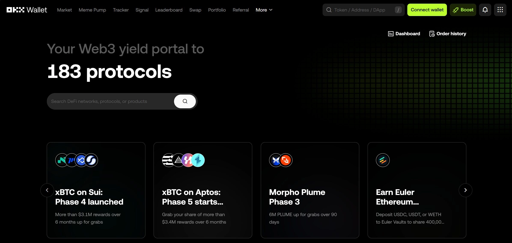
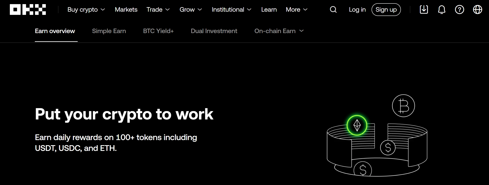

# OKX交易所深度测评：交易、安全与费率全解析

想找个靠谱的加密货币交易平台？不想踩坑、不想被复杂的界面搞晕、更不想担心资金安全？那你可能需要看看OKX。这个平台在2017年就开始折腾了,现在已经是全球前五的交易所,日均交易量400亿美元——听起来挺唬人,但真正重要的是:它到底适不适合你用?本文会用最直白的语言告诉你OKX的真实情况,包括那些别人不太说的细节。

---

## OKX是什么?一个从OKcoin演变来的老平台

OKX的创始人叫Star Xu,2017年正式成立,总部在塞舌尔。不过它的历史其实更长——2013年就以OKcoin的名字出现了,2017年改名OKEX,2022年才叫OKX。这种不断改名的操作,要么说明它在不断适应监管,要么说明它在找定位。

现在的OKX支持350多种数字资产和100多种法币,全球员工超过5000人,用户超过5000万。这些数字听起来很厉害,但关键问题是:它能给你带来什么?

## 核心功能:从现货到衍生品,应有尽有

### 现货交易:最基础但也最实用

OKX的现货交易支持BTC/USDT、ETH/USDT这种主流交易对,流动性好,点差小。你可以用限价单、市价单、止损单这些常规操作,还有深度图、内置指标、多种图表布局。说白了,就是该有的都有。

### 衍生品交易:杠杆玩家的天堂

OKX的衍生品市场提供USDT保证金的永续合约和期权交易。它用的是统一账户系统,意思是你可以用同一笔保证金在不同产品之间切换,不用来回转账。这个设计对高频交易者来说挺友好,但如果你是新手,可能会觉得有点绕。

### 跟单交易:懒人赚钱法?

👉 [不想自己研究K线图?试试OKX的跟单交易功能](https://www.okx.com/join/62834398)

OKX的跟单功能让你直接复制高手的操作。平台会自动同步代币分配,你啥都不用管。当然,如果赚了钱,高手要分走8%-13%的利润。这个功能听起来很美好,但别忘了:高手也会亏钱,而且过去的收益不代表未来。

### 期权交易:进阶玩家的游戏

OKX的期权交易支持BTC和ETH,有期权链和RFQ(询价)两种模式。如果你懂期权,这是个不错的工具;如果你不懂,建议先别碰——期权的风险比现货高得多。

### 交易机器人:24小时不睡觉的打工人

OKX提供12种预设的交易机器人,可以24/7自动执行交易策略。如果你懂编程,还可以自己写机器人,并从跟单者那里赚取最高30%的利润。听起来很酷,但前提是你的策略真的有效。

## Web3生态:OKX不只是交易所

### OKX钱包:你的Web3入口

OKX钱包是一个非托管的多链钱包,支持130多条区块链。它不仅能存币,还能访问超过10,000个DApp,覆盖DeFi、游戏、社交等各种场景。钱包用了MPC(多方计算)和生物识别技术,安全性还算靠谱。

但有一点要注意:非托管意味着你要自己保管私钥。如果丢了,OKX也救不了你。

### NFT市场:买卖数字藏品的地方

OKX的NFT市场支持Magic Eden和OpenSea,你可以在这里买卖NFT。如果你对数字艺术或游戏道具感兴趣,这个功能可能有用。但如果你不懂NFT,建议先观望——这个市场的泡沫和风险同样巨大。

### DeFi集成:直接访问去中心化金融

OKX的Web3生态让你可以直接访问超过1,000个DeFi协议。你可以在平台上完成质押、流动性挖矿、借贷等操作,不用跳转到其他平台。这种垂直整合确实方便,但也意味着你更依赖OKX这个单一入口。

### OKX Chain(OKC):自家的区块链

OKX还搞了自己的区块链OKC,基于Cosmos SDK构建,支持EVM。它的原生代币是OKT,用的是DPoS共识机制。不过说实话,除非你是开发者或者对链上生态特别感兴趣,普通用户基本用不上。

## 安全性:到底靠不靠谱?

OKX在安全方面做得还不错。第三方评级平台CER.live给它打了AAA评级,安全分数90%。更重要的是,OKX从成立到现在没出过重大安全事故——这在交易所圈子里算是少见的。

平台把90%以上的用户资产存在冷钱包里,还提供2FA(双重认证)和防钓鱼码。定期的安全审计和储备证明报告也增加了透明度。CoinGecko给OKX打了10/10的信任分,这个分数确实不低。

但有一点要提醒:再安全的平台也无法防止你自己的失误。如果你的密码太简单,或者在钓鱼网站上输入了私钥,神仙也救不了你。

## 费率:到底贵不贵?

### 现货交易费率

- **普通用户**:Maker费率0.08%,Taker费率0.10%
- **VIP用户**:交易量越大,费率越低,最低可以降到Maker 0.02%,Taker 0.05%

### 期权交易费率

- **普通用户**:Maker费率0.02%,Taker费率0.03%
- **VIP用户**:费率可以进一步降低

### 价差交易费率

### 充提费用

OKX不收充值费,但提现会有小额的链上手续费,具体取决于网络拥堵情况。如果你充值的金额低于最低门槛,可能会有额外费用,最好先联系客服确认。

总体来说,OKX的费率在行业里算是中等偏低,如果你是大户,VIP费率会更香。

## OKX Earn:让闲置资产动起来

OKX Earn是一个让你用加密货币赚取被动收入的平台。你可以选择以下几种方式:

### Simple Earn:像银行存款一样简单

把闲置的币存进去,赚取利息。你可以选择活期(随时取)或定期(锁定一段时间)。利息率由市场决定,平台会做风控。

### On-Chain Earn:链上DeFi和质押

你可以参与DeFi协议或者PoS质押来赚取收益。比如提供流动性、借贷、收益农场等等。风险和收益都比Simple Earn高。

### Dual Investment:类似期权的玩法

用BTC、ETH或USDT订阅产品,押注未来价格。无论涨跌,你都能拿到固定的年化收益,期限从几小时到几个月不等。这个产品有点像结构化理财,需要一定的理解能力。

### BTC Yield+:闲置BTC也能赚钱

把BTC存进去,每天赚取收益,年化最高3%。相比传统的BTC质押,这个产品的优势是你还能随时访问自己的资产。

### 加密货币贷款:用币做抵押借款

你可以用100多种加密货币作为抵押,借出其他币。还款灵活,可以随时部分或全部偿还。

### Jumpstart:参与新项目的早期发行

在新代币上市前以折扣价购买,或者通过挖矿赚取奖励。这个有点像打新股,但风险也不小——很多新项目可能一文不值。

## OKX App:随时随地交易

OKX的手机App功能很全,界面也算友好。它集成了中心化交易所(CEX)和去中心化交易所(DEX)的功能,支持实时图表、多种订单类型、行情提醒等。

**优点:**
- 功能丰富,适合进阶用户
- 集成了Web3钱包,方便DeFi操作
- 速度快,界面流畅

**缺点:**
- 功能太多可能吓到新手
- 有用户反映KYC验证流程复杂
- 法币提现流程不够直观

总体来说,如果你已经熟悉加密货币交易,OKX App是个强大的工具;如果你是纯新手,可能需要花点时间适应。

## 如何开始使用OKX?

1. **访问官网或下载App**
2. **注册账户**:用邮箱或手机号注册
3. **完成KYC验证**:上传身份证件,拍照验证
4. **充值**:选择加密货币充值或法币充值
5. **开始交易**:选择现货、合约或其他产品

整个流程不复杂,但KYC验证可能需要几个小时到几天不等,取决于平台的审核速度。

## 监管合规:OKX在哪些地方能用?

OKX非常重视监管合规,拥有多个国家和地区的牌照,包括欧盟、澳大利亚、新加坡等。它是第一个获得欧盟MiCA预授权的交易所,这意味着它可以在欧洲经济区(EEA)合法运营。

**可用地区:**
- 欧盟大部分国家
- 英国(但没有FCA监管)
- 新加坡(部分产品受限)
- 澳大利亚
- 中东部分国家

**不可用地区:**
- 美国(仅通过OKCoin提供有限服务)
- 伊朗、古巴、阿富汗等受制裁国家

**注意:**即使在可用地区,某些衍生品功能可能也受限。使用前最好确认你所在地区的具体政策。

## 客户支持:有问题怎么办?

OKX提供24/7在线客服,还可以通过邮箱(support@okx.com)联系。大部分问题会在2-3分钟内解决,目标是10分钟内回复。

**联系方式:**
- 在线客服(最快)
- 邮箱
- X(Twitter)
- Telegram
- Discord
- Reddit社区

**用户评价:**
- Capterra上评分4.5星,用户觉得界面友好、工具强大
- Trustpilot上评分2.9星,主要是因为提现被冻结和客服回复太模板化

说实话,客服这种事情见仁见智。如果你遇到问题,最好先查看帮助中心的FAQ,很多常见问题都能自己解决。

## OKX的品牌合作:从足球到赛车

OKX这些年做了不少品牌合作:
- **曼城足球俱乐部**:2022年成为官方训练装备合作伙伴
- **McLaren车队**:2022年成为主要加密货币赞助商
- **澳大利亚奥运队**:合作推广Web3技术
- **LIV Golf**:赞助Majesticks GC战队(2023-2024)
- **渣打银行**:成为其机构客户的第三方加密货币托管方

这些合作一方面提升了OKX的品牌形象,另一方面也说明它在努力拓展主流市场。

## OKX值得用吗?总结一下

**适合你如果:**
- 你想要功能全面的交易平台
- 你对衍生品和高杠杆交易感兴趣
- 你想探索DeFi和Web3生态
- 你是高频交易者,在乎费率

**不适合你如果:**
- 你是纯新手,觉得功能太多太复杂
- 你在美国或其他受限地区
- 你只想简单买币存着,不需要那么多功能

总的来说,OKX是一个功能强大、安全性高、费率合理的加密货币交易平台。它的Web3生态和衍生品市场是亮点,但也意味着学习曲线比较陡峭。如果你愿意花时间研究,OKX能提供很多玩法;如果你只想简单买币,也许Coinbase或Binance更适合你。

最后提醒一句:加密货币投资有风险,别投入你承受不起损失的钱。👉 [准备好了?用邀请码62834398注册OKX,享受优惠费率](https://www.okx.com/join/62834398)

---

## 常见问题

**OKX安全吗?**
是的,OKX采用了行业标准的安全措施,90%以上的资产存在冷钱包,还提供2FA和防钓鱼码。自成立以来没出过重大安全事故。

**美国用户能用OKX吗?**
不能完全使用。由于监管限制,OKX在美国只能通过子公司OKCoin提供有限服务。

**OKX和Binance哪个更好?**
Binance的交易量更大,支持的币种也更多。但OKX在衍生品和Web3生态方面有优势。具体选哪个,取决于你的需求。

**OKX和Coinbase哪个更安全?**
两者都是信誉良好的交易所。Coinbase更受美国用户青睐,因为它受SEC监管;OKX在全球范围内的功能更全面。

**怎么从OKX提现?**
加密货币可以直接提现到其他钱包;法币需要先通过P2P市场卖出,然后提现到银行账户或电子钱包。

**怎么在OKX赚钱?**
可以通过OKX Earn的DeFi质押、Simple Earn、Dual Investment、保证金交易、交易机器人、跟单交易或联盟计划赚钱。

**OKX App靠谱吗?**
是的,OKX App被全球超过5000万交易者使用,TradingView最近还授予它"最可靠技术"奖。

**免责声明:**本文内容仅供参考,不构成投资建议。加密货币投资有高风险,请自行做好充分研究。所有交易和转账风险自负,任何损失由您自行承担。
